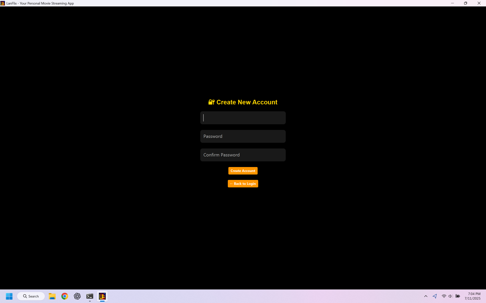
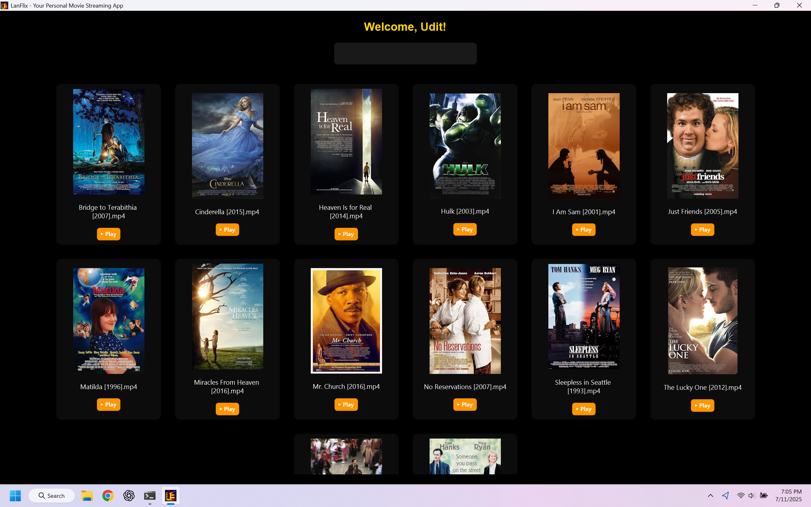
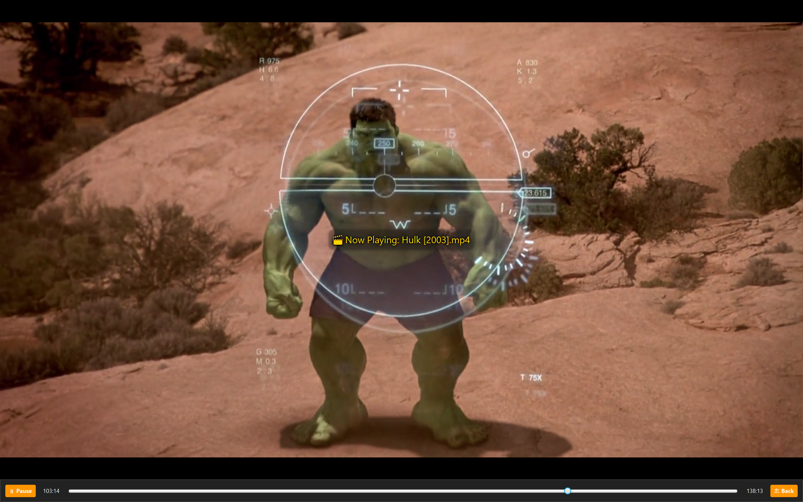

<p align="center">
  
</p>

# LanFlix – LAN Movie Streaming App

LanFlix is a self-hosted movie streaming application designed to stream video files over a local area network (LAN). It provides a lightweight, efficient, and secure Netflix-like experience entirely offline, enabling users to browse and stream their personal video libraries from a centralized server to multiple client machines without requiring an internet connection or third-party services.

---

## Table of Contents

- [Overview](#overview)
- [Architecture](#architecture)
- [Key Features](#key-features)
- [Technical Stack](#technical-stack)
- [Setup Instructions](#setup-instructions)
- [Usage](#usage)
- [Troubleshooting](#troubleshooting)
- [Distribution](#distribution)
- [License](#license)

---

## Overview

LanFlix is structured as a Java-based client-server system using JavaFX for its UI and Java's built-in HTTP server for network communication. The server hosts and streams video files from a shared directory, while clients on the same LAN can browse and stream this content. This system eliminates the need for online services and allows users to retain full control over their media.

---

## Architecture

### Server Components

- **MovieServer.java**: HTTP server serving media and metadata
- **DatabaseManager.java**: SQLite-based manager for movies and users
- **AuthHandler.java**: HTTP handler for login authentication
- **MovieMetadata.java**: Model for storing movie details

### Client Components

- **LoginPane / SignupPane**: Secure user authentication
- **ServerConnectPane**: Connect to server manually or via discovery
- **MovieBrowserPane**: Displays movies with real-time search and posters
- **VideoPlayerPane**: Fullscreen embedded media playback interface
- **AppConfig**: Handles client config and auto-discovery logic
- **MainSceneManager**: UI navigation controller

---

## Key Features

- **Video Streaming**: Serves MP4 files via HTTP with byte-range support
- **Client-Server Model**: Streamlined architecture using core Java libraries
- **Authentication**: Secure sign-up and login with password hashing (bcrypt)
- **Movie Catalog**: Metadata display and optional poster fetching using OMDb API
- **Automatic IP Discovery**: Uses UDP multicast to locate server on LAN
- **Error Handling**: Graceful dialog prompts for playback errors and retries
- **Modern UI**: Built using JavaFX with responsive layouts and custom styling

---

## Technical Stack

- Java 17 (Liberica JDK recommended)
- JavaFX 17 (UI framework)
- SQLite (for persistent storage of users and movies)
- OMDb API (for fetching movie posters)
- Windows (tested on Windows 10 and 11)
- IntelliJ IDEA (recommended for development)

---

## Setup Instructions

### Prerequisites

1. **Install JDK 17**  
   Download BellSoft Liberica JDK from:  
   https://bell-sw.com/pages/downloads/#jdk-17-lts

2. **Install JavaFX SDK**  
   Download JavaFX SDK 17 from:  
   https://gluonhq.com/products/javafx/

3. **Configure JavaFX in IntelliJ**  
   - File → Project Structure → Libraries → Add JavaFX SDK `lib` folder
   - Add VM Options:
     ```
     --module-path "path\to\javafx-sdk\lib"
     --add-modules javafx.controls,javafx.fxml,javafx.media
     --enable-native-access=javafx.graphics
     ```

4. **Create Movie Directory**  
   Create a folder named `LanFlix Movies` in `C:\Users\<YourUsername>\Videos\` and place your MP4 files inside it.

---

## Usage

### Running the Application from Source

1. **Start the Server**  
   Run `ServerMain.java`  
   The console will indicate the server is running.

2. **Run the Client**  
   Run `Main.java` on any LAN-connected device  
   On first launch, enter the server IP manually or wait for auto-discovery.

3. **Create an Account**  
   Sign up with a new username and password.

4. **Browse and Stream**  
   Browse your movie library, view details, and play directly from the UI.

---

## Troubleshooting

- **Playback not working**: Ensure video is in MP4 format with H.264/AAC encoding.
- **IP not detected**: Use `ipconfig` on server PC to manually get its LAN IP.
- **Firewall issues**: Ensure port 8080 is open and Java is allowed through firewall.
- **Poster not loading**: Ensure movie file names are accurate; OMDb fetch is optional.
- **Server Discovery Fails**: Multicast may be blocked by certain routers—manual IP entry will still work.

---

## Distribution

LanFlix is available as packaged Windows executables for easy distribution:

| File                | Description                        |
|---------------------|------------------------------------|
| `LanFlixServer.exe` | Install this on the host/server PC |
| `LanFlixClient.exe` | Install on any LAN-connected client|

To download the latest release, visit the [Releases](https://github.com/Udit-Gavasane/LanFlix/releases) section.

Both installers are compatible with Windows 10 and 11.

---

## License

This project is licensed under the MIT License. See the [LICENSE](LICENSE) file for details.

---

## Notes

- This project was developed for academic submission and real-world LAN usage scenarios.
- It is fully functional without internet access after installation and setup.

---

## Screenshots

<p align="center">
  
  
  
  
  
</p>

